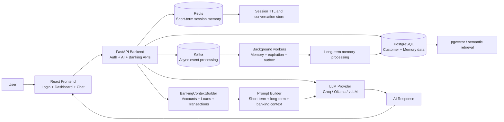

# FATUY (Financial Assistant That Understands You)

A full-stack AI banking assistant built with Python, FastAPI, React, PostgreSQL, Redis, Kafka, and LLM providers( Ollama, vLLM). It gives customers a conversational interface to ask about balances, transactions, loans, and account activity while preserving short-term and long-term memory for personalized responses.

## Overview

This project combines:

- a React frontend for login and dashboard experience
- a FastAPI backend for APIs, auth, and AI orchestration
- PostgreSQL for persistent customer and memory data (Simply Long term Memory)
- Redis for short-term conversation sessions
- Kafka for asynchronous background processing
- Groq, Ollama, and vLLM support for LLM access

## Built With

- Frontend: React, TypeScript, Vite, React Router
- Backend: Python, FastAPI, SQLAlchemy, Pydantic
- Data: PostgreSQL, Redis, Kafka, pgvector-ready architecture
- AI: Groq, Ollama, vLLM
- DevOps: Docker Compose

## Project Structure

```text
banking-ai/
├── .env.example
├── .env
├── docker-compose.yml
├── README.md
├── backend/
│   ├── Dockerfile
│   ├── requirements.txt
│   ├── alembic/
│   └── app/
│       ├── ai/
│       ├── api/
│       ├── core/
│       ├── models/
│       ├── schemas/
│       ├── services/
│       ├── workers/
│       └── main.py
├── frontend/
│   ├── Dockerfile
│   ├── package.json
│   └── src/
├── infrastructure/
│   ├── kafka/
│   ├── postgres/
│   └── redis/
└── .gitignore
```

## Features

- Customer login and profile retrieval
- AI chat with banking context
- Short-term memory via Redis session store
- Long-term memory persistence in PostgreSQL
- Automatic expiration of conversation sessions
- Kafka-based async memory processing
- Prompt assembly using customer, banking, and memory context
- Support for multiple AI providers
- Banking data access for balances, transactions, and loans
- Dashboard UI for customer information and account overview

## How Short Term and Long-Term Memory works Inside Application

Short Term Memory:

- 1st when the user starts his 1st conversation, then immediately in redis, a session gets created with a random session_id : uuid.
- 2nd Once he asks the questions and session starts, now the redis starts its Time to Live(TTL) simply countdown's back from 30mins.
- 3rd In the time frame of 29 minutes 59 seconds to 0 minutes 1 second, if User asks any question then again the TTL resets to 30 minutes, like this the loop continues until user stops coversation.
- 4th Once session is idle for More Than 30minutes, it gets closed and sends to Kafka to send the session data to LLM to give a summary of this short term conversations , and checks whether is there any useful context that is useful for storing in user's longterm memory(postgresDB) 


Long Term Memory:

- Once the Session data comes to Kafka broker, now its task is to send to LLM for summary and take it back and save it to PostgresDB for longterm Memory.
- So whatIf there is a case if LLM goes down or DB goes down, and if there is any useful context of user is there, now will it be gone to void ??
- No Here i have added a Layer which was inspired from whatsapp messaging, Kafka acts as the durable buffer between conversation expiration and memory processing. The event remains in Kafka until the Memory Worker successfully processes it.(simply whatsapp's single tick, double tick, blue tick mechanism). 
```
                Conversation Event Created
                        ↓
                Kafka receives event
                        ↓
                ✓ Single Tick
                Event accepted by Kafka
                        ↓
                Memory Worker consumes event
                        ↓
                LLM processes conversation
                        ↓
                ✓✓ Double Tick
                Memory processing completed
                        ↓
                PostgreSQL saves long-term memory
                        ↓
                🔵✓ Blue Tick
                Memory successfully persisted
```

This keeps the user experience fast while asynchronously managing stored memory and expired conversations.

## Architecture



This architecture keeps short-lived conversation state in Redis, persistent memory and customer records in PostgreSQL, and asynchronous processing in Kafka so the assistant stays responsive while handling memory and session tasks in the background.

## Prerequisites

- Docker + Docker Compose
- Python 3.12+
- Node.js 22+
- npm
- LLM access credentials or a local model endpoint

## Quick Start

1. Copy the example environment file:

```bash
cp .env.example .env
```

2. Update the values in `.env` with your own configuration.

3. Start the full stack:

```bash
docker compose up --build
```

This will start:

- frontend at `http://localhost:3000`
- backend at `http://localhost:4000`
- PostgreSQL at `localhost:5432`
- Redis at `localhost:6379`
- Kafka at `localhost:9092`

4. Open the frontend in the browser and log in.

## Backend Setup (manual)

```bash
cd backend
python -m venv .venv
source .venv/bin/activate
pip install -r requirements.txt
uvicorn app.main:app --host 0.0.0.0 --port 4000 --reload
```

Swagger UI is available at:

- `http://localhost:4000/docs`

## Frontend Setup (manual)

```bash
cd frontend
npm install
npm run dev -- --host 0.0.0.0 --port 3000
```

## Core API Routes

### Authentication

```http
POST /auth/login
GET /auth/me
```

### Dashboard

```http
GET /dashboard
```

### AI

```http
POST /ai/chat
```

### Banking data

```http
POST /api/v1/accounts/balance
POST /api/v1/transactions/search
POST /api/v1/loans
POST /api/v1/loans/history
```

## Example AI Chat Request

```json
{
  "user_id": "<customer-id>",
  "message": "What is my total balance?",
  "provider": "groq or ollama or vLLM",
  "session_id": null(for 1st convo) or your active session_id
}
```

## How the AI Flow Works

1. The user logs in and a JWT is issued.
2. The frontend sends a chat message to `/ai/chat`.
3. The backend validates the user session.
4. Redis loads short-term conversation messages.
5. PostgreSQL loads long-term relevant memories.
6. Banking context is added from the user’s accounts, loans, and transactions.
7. A Mega prompt is built and sent to the selected LLM provider.
8. The response is stored in Redis and returned to the user.
9. Background workers handle session expiration(30mins) and async memory processing.

## Database and Background Workers

The backend starts background services for:

- Kafka event publishing
- outbox processing
- session expiration handling
- memory worker processing

This keeps the user experience fast while asynchronously managing stored memory and expired conversations.

## Docker Commands

```bash
# Start services
docker compose up -d

# Stop services
docker compose down

# Rebuild all containers
docker compose build --no-cache

# Remove volumes and reset state
docker compose down -v
```

## Troubleshooting

### Port conflicts

If Docker reports port conflicts, stop existing services using the ports:

- 3000
- 4000
- 5432
- 6379
- 9092

### Backend not starting

Check logs:

```bash
docker compose logs -f backend
```

Look for missing environment variables or startup errors from Postgres or Redis.

### AI provider not responding

Verify:

- the API key is set correctly
- the model name matches your provider
- the endpoint is reachable
- your provider is enabled in `AI_PROVIDER_PRIORITY`

## Notes

- The app is organized for development and demo use.
- It is designed to be extensible for a production banking product.
- The memory layer and AI orchestration are central to the project’s design.
- For testing, you can set SESSION_TTL_SECONDS in env to a lower value like 80 seconds. In production, it should be higher.

## Summary

This project is a practical AI banking assistant that demonstrates a real-world pattern for combining customer data, conversational memory, and LLM-driven responses in a secure and modular architecture.

To run everything quickly:

```bash
cp .env.example .env
docker compose up --build
```

Then visit:

- Frontend: `http://localhost:3000`
- Backend docs: `http://localhost:4000/docs`